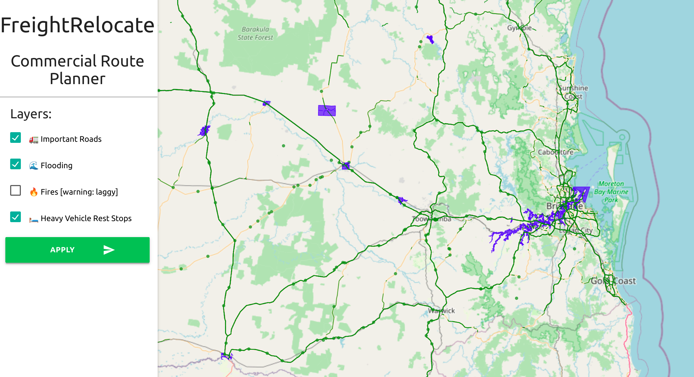
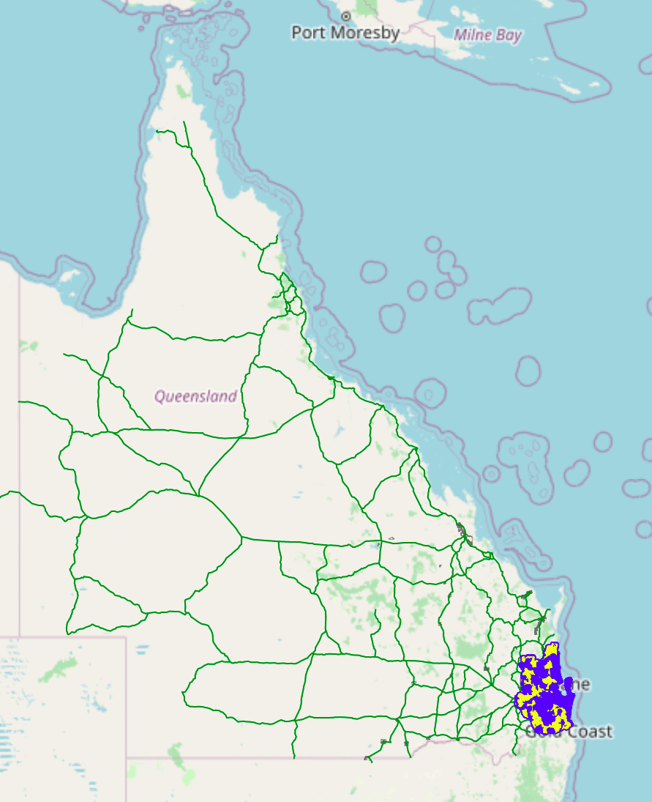

# FreightRelocate by Milk Is Optional
## GovHack 2022 Submission

*Original image by Christopher High, used under the Unsplash License. [Source](https://unsplash.com/photos/O8dcG8oniJU)*

This is a GovHack 2022 submission, primarily targeted at the [flood, fire and the future: the road to resilience](https://2022.hackerspace.govhack.org/challenges/flood_fire_and_the_future_the_road_to_resilience) challenge. We created a data visualisation tool, with the idea that future expansions would make this an indispensable tool for freight companies. 

The project consists of a map, with various layers such as historical flood data, regions at risk of being affected by bushfires and routes appropriate for heavy vehicles. 

In this screenshot, green routes are ones commonly used by heavy traffic (as determined by the traffic census data), blue areas have been flooded in the past and green dots represent rest stops. 

## Proof of Concept Limitations
We had to narrow the scope for the proof of concept, due to the limited time and manpower (team of 2).
- For the proof of concept, only Queensland data was used, for ease of development. In a real product, the entirety of Australia would naturally be considered.
- Pandemic complications are not considered, since only one state is being considered. Unlike some other states, Queensland has not split the state into multiple sections with border controls between the sections, which also makes this unnecessary. Whilst the national plan also includes provisions for localised lockdowns for quashing outbreaks, this is not something which appears to be done anywhere in Australia and thus does not need to be considered at this stage. 
- Bushfire visualisation was partially working previously, but we ran out of time to fix it after moving to a faster rendering method. These datasets are also too large to upload to GitHub. Yellow areas in this screenshot from an earlier prototype show the south-east Queensland areas particularly at risk: 

## Future Improvements
- Allow users to enter (and store) routes. This tool could then show which sections of the route are at most risk and how long detours would take. 
- Show auxillary information - routing should take rest stop locations into account, for instance, and the estimated cost for each detour. For in-progress routes, the vehicle's current locations could be super-imposed.
- Use data from the Bureau of Meteorology to show routes which could potentially be affected within the next 24 hours.
- Use data from emergency services and local councils to show which routes are being affected *right now*. 
- Based on the three previous dot points and data about the cargo, it can prioritise routes that need to be reviewed based on urgency, risk and importance.

## Data Used
- [2020 traffic census data](https://www.data.qld.gov.au/dataset/traffic-census-for-the-queensland-state-declared-road-network/resource/1f52e522-7cb8-451c-b4c2-8467a087e883)
- [Flood Extent Series](https://www.data.qld.gov.au/dataset/flood-extent-series)
- [Bushfire Prone Area](https://www.data.qld.gov.au/dataset/bushfire-prone-area-queensland-series)
- [Harmonised National Roadworks](https://data.datahub.freightaustralia.gov.au/dataset/harmonised-national-roadworks)
- [Heavy Vehicle Rest Areas](https://data.datahub.freightaustralia.gov.au/dataset/heavy-vehicle-rest-areas)